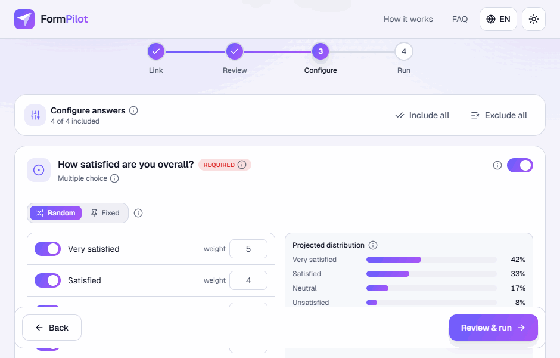
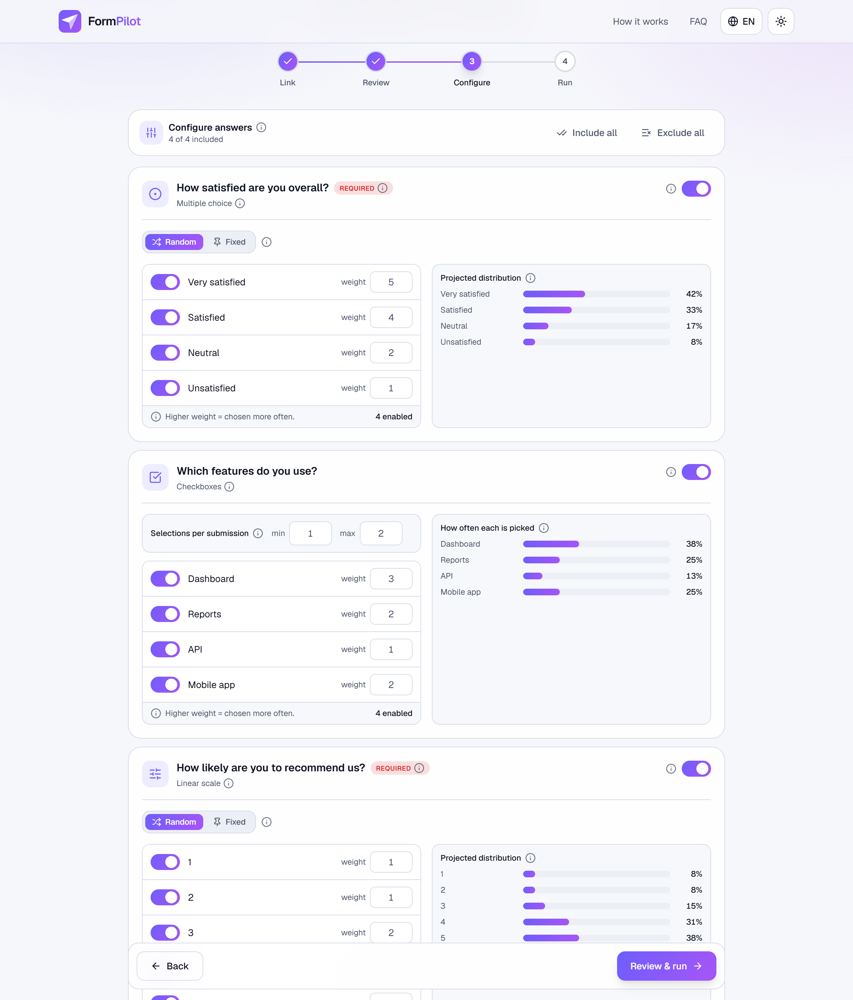
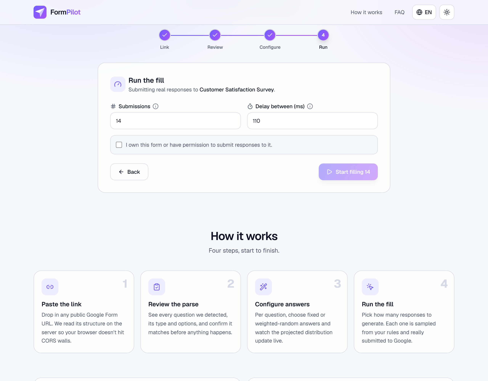
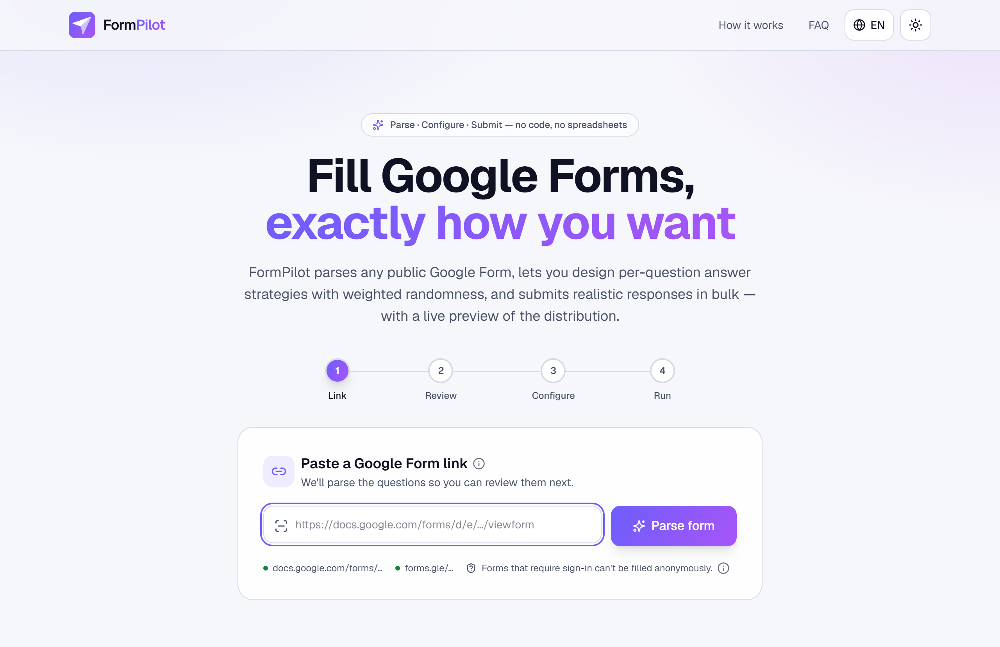
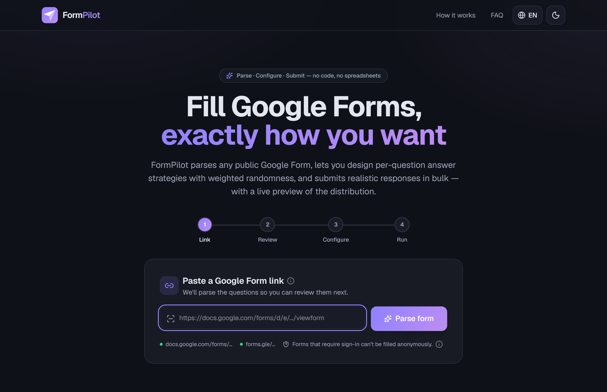
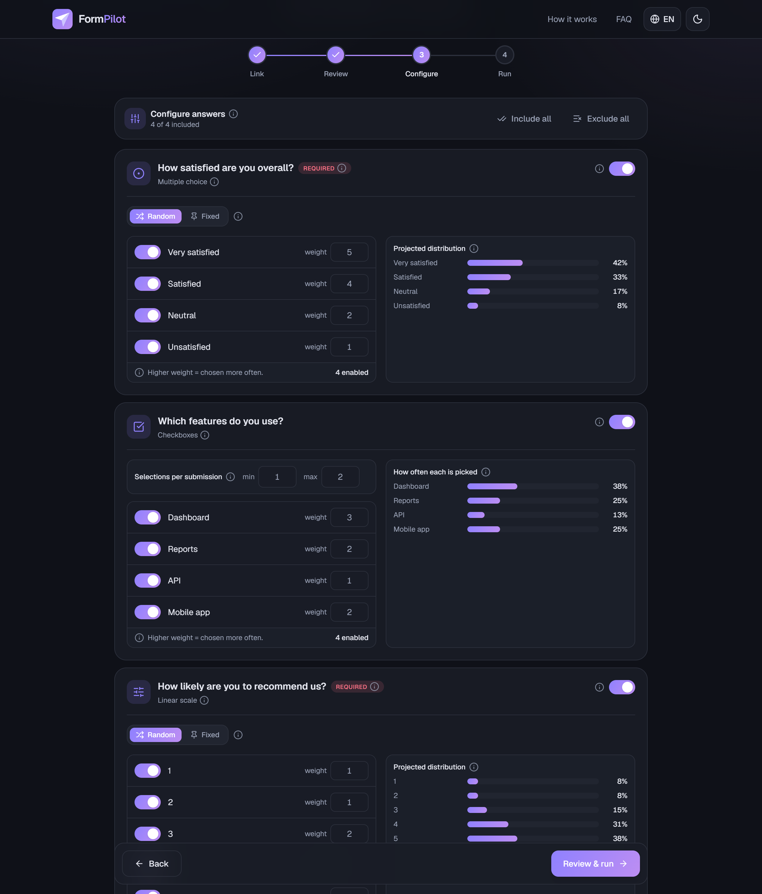
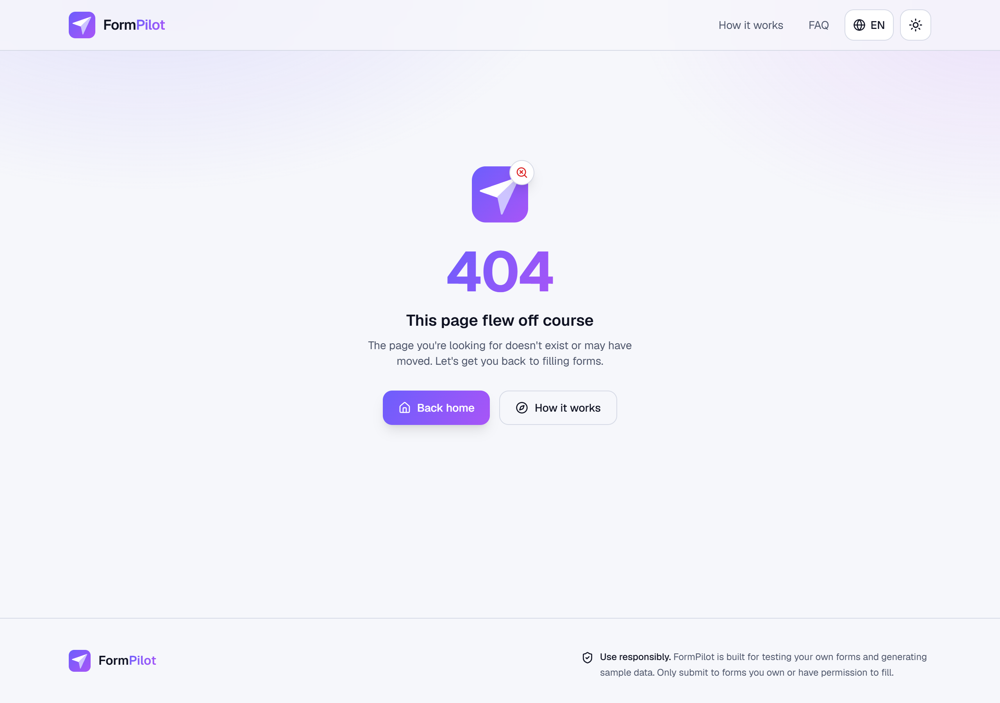
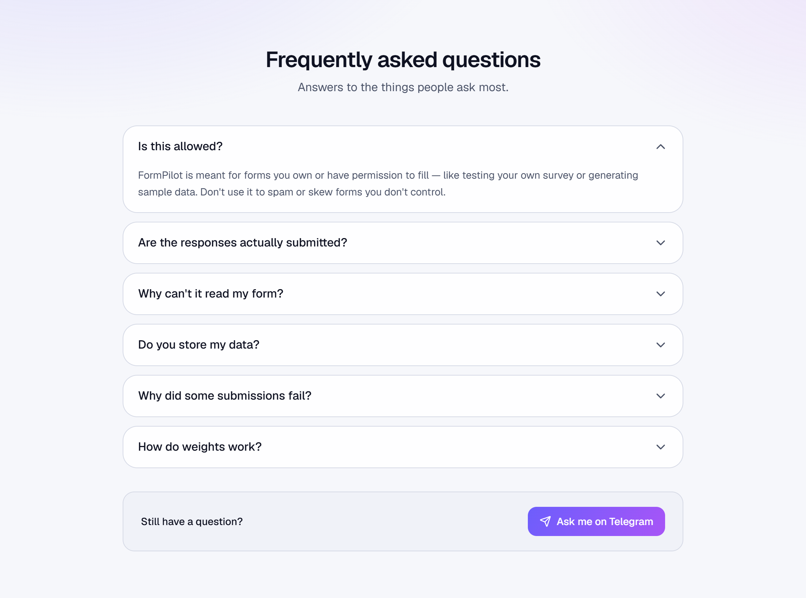

# FormPilot

**Parse, configure, and auto-fill Google Forms with smart answer distributions.**

FormPilot takes a public Google Form link, reads its structure, and lets you
design a per-question answer strategy — fixed values or weighted-random choices
— then submits as many realistic responses as you want. It ships as a polished,
fully bilingual (English 🇬🇧 / Russian 🇷🇺) web app: a guided wizard, live
distribution previews, tooltips everywhere, light & dark themes, smooth
animations, and graceful 404 / 500 pages.

<p align="center">
  
</p>
<p align="center"><em>Switching theme &amp; language, then configuring and running a fill.</em></p>

> ⚠️ **Use responsibly.** FormPilot is meant for testing forms you own or
> generating sample data with permission. Don't use it to spam or manipulate
> forms you don't control.

---

## ✨ Highlights

- **Paste → parse → review → configure → run** in a single guided wizard.
- **Weighted-random or fixed** answers per question, with a **live preview** of
  the projected distribution that updates as you tweak the weights.
- For text questions, **type your own answers and weight each one** — responses
  are drawn from them in the proportions you set.
- Handles short answer, paragraph, multiple choice (incl. *Other*), dropdown,
  checkboxes (min/max), linear scale, date, time, and grids.
- **Real submissions** — responses are actually POSTed to Google, with a live
  progress bar and a breakdown of what was really sent.
- **Pause, reconfigure, and resume** from where you stopped — or **retry just the
  failed** submissions and see why each one failed.
- **No account, no database** — your form and settings live in `localStorage`.
- English / Russian UI, light & dark themes, keyboard-friendly tooltips, and a
  custom 404 + 500 error experience.

---

## 📸 Screenshots

### Configure answers — the heart of the app
Weighted options with a live, updating distribution preview per question.



### Run the fill
Choose how many responses to generate and watch them go out in real time.



### Light & dark themes

<p>
  
  
</p>

### Configurator in dark mode & a friendly 404

<p>
  
  
</p>

### Built-in FAQ



---

## 🧭 How to use

1. **Paste a link.** Drop in any *public* Google Form URL — either
   `https://docs.google.com/forms/d/e/…/viewform` or a `https://forms.gle/…`
   short link. Click **Parse form**.
2. **Review the parse.** FormPilot shows every question it detected, its type,
   and its options. Confirm it looks right (or go back and fix the link).
3. **Configure answers.** For each question decide:
   - whether it's **included** at all,
   - **Fixed** (always the same answer) or **Random** (weighted),
   - which options are in the pool and their **weights** — the *Projected
     distribution* bars show the resulting split live,
   - for checkboxes, how many options to pick per submission (min–max),
   - for text questions, a pool of answers to draw from.
   Hover any **ⓘ** icon for an explanation of what a setting does.
4. **Run the fill.** Set the number of submissions and the delay between them,
   confirm you have permission, and hit **Start**. You'll see a live progress
   bar, success/failure counts, and — when it finishes — the *actual*
   distribution of everything that was sent.

Your progress is saved to the browser automatically, so you can close the tab
and pick up where you left off.

### Supported question types

| Type | Supported | Notes |
| --- | :---: | --- |
| Short answer / Paragraph | ✅ | Random pick from a pool, or a fixed value |
| Multiple choice / Dropdown | ✅ | Weighted, with *Other* free-text support |
| Checkboxes | ✅ | Weighted, with a min–max number of selections |
| Linear scale | ✅ | Each point is a weightable option |
| Date / Time | ✅ | Fixed value per submission |
| Grid | ✅ | Each row weighted independently |
| File upload & others | ⏭️ | Detected and skipped |

> Forms that require sign-in or collect emails can't be read or filled
> anonymously — FormPilot detects this and tells you. Forms behind reCAPTCHA may
> reject automated submissions.

---

## 🛠️ Run locally

**Prerequisites:** Node.js 18.18+ (Node 20/22 recommended) and npm.

```bash
# 1. Install dependencies
npm install

# 2. Start the dev server
npm run dev
```

Open <http://localhost:3000>.

Other scripts:

```bash
npm run build   # production build (type-checks + lints)
npm start       # serve the production build
npm run lint    # run ESLint
```

> The form parser fetches Google's HTML **server-side** (the browser can't, due
> to CORS), so it needs outbound internet access — the standard `npm run dev`
> environment has that out of the box.

---

## 👤 Author

Built by **[@mLastovskyy](https://github.com/mLastovskyy)** as a portfolio
project.

Questions or feedback? Message me on Telegram:
**[@Maksim_Lastovsky](https://t.me/Maksim_Lastovsky)**.

## 📄 License

See [LICENSE](./LICENSE). Not affiliated with or endorsed by Google.
